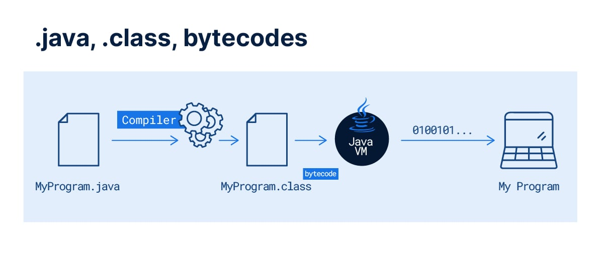

## Maratona Java | DevDojo
# Introdução Java
### 1. Como funciona o Java?
- Java é muiltiplataforma e roda numa camada chamada JVM (Java Virtual Machine). É uma linguagem que é compilada, arquivos .JAVA são transformados em arquivos .class (bytecode) que são interpretados pela JVM, comunicando-se com o SO.

- Necessitamos utilizar JDK (Java Development Kit) que é um conjunto de ferramentas para desenvolvimento de softwares em Java.
- Exemplo de código em Java:

```
package academy.devdojo.maratonajava.introducao;
public class Aula01OlaDevDojo {
	public static void main(String[] args){
		System.out.println("KA-ME-HA-ME-HAAA");	
	}
}
```
- O uso de pacotes é interessante para organização das classes do projeto.
### 2. Tipos primitivos e String
- Os tipos primitivos são: int, double, float, char, byte, short, long, boolean. Variáveis declaradas fora do método (fora do escopo local) tem valor de inicialização.
- Casting: posso forçar um dado numa variável maior que a sua capacidade, por exemplo, um número muito grande num short. Resultado armazenado não é previsível. Serão cortados bits.
```
float número = (float)2500.80; 
```
- String é uma classe. Utilizar " " na declaração.
````declarative
String nome = "Lucas";
````
### 3. Operadores
- Aritiméticos: (+ - / * %)
- Aritiméticos unários: ++ --
- Lógicos: < > <= >= == != && (AND) || (OR) !(NOT). Sempre retornam valores booleanos.
  - &&: verdadeiro para todas as condições verdadeiras.
  - ||: basta uma condição verdadeira para ser verdadeiro.
- Atribuição: = += -= *= /= %=
````declarative
int number1 = 97;
int number2 = 27;
float number3 = 2.5F;
float number4 = 250.0F;
int number5 = 2;
int soma = number1+number2;
int subtracao = number1-number2;
float divisao = number4/number3;
int multiplicacao = number1 * number2;
boolean isGreaterThan = number4 >= number1;
boolean isLessThan = number4 < number1;
boolean isEqual = 'a' == number1;
boolean isDifferent = number4 != number1;
````
### 4. Estruturas condicionais
- if(condição): bloco de código será executado se condição for verdadeira.
- else: executado se condição do if for falsa.
- if else podem ser utilizados encadeados.
- Operador ternário: ***(condição) ? verdadeiro : falso***
````declarative
int idade = 18;
boolean chavesMentira = true;
boolean resultado = false;
resultado = (idade >= 18 || !chavesMentira) ? !resultado : !!resultado;
System.out.println(resultado);
````
*Variáveis locais devem ser inicializadas, evitando erro de compilação.*

- switch: Estrutura permite visualização melhor que encadear vários "if else". Se não houver inclusão do break há execução dos todos os casos após condição.

### 5. Estruturas de repetição

- while(condição){}: enquanto condição for verdadeira executa bloco de código.
- do{} while(condição): executa uma vez o bloco de código e repete laço de repetição enquanto a condição for verdadeira.
- for(iterador, condição, ação): define um iterador, enquanto condição for verdadeira realizará a ação. Pode-se utilizar break para parar iteração. Continue ignora linhas subsequentes e realiza iteração.

### 6. Arrays

- Alocação de dados contígua na memória. A declaração de um Array faz referência a um objeto de memória. Não podemos acessar posição que não existe no Array. Podemos iterar sobre posições do Array(indexado a partir do 0). Tamanho do Array não pode ser aumentado dinamicamente. Ao realizar nova atribuição à Array declarado (Array = new Array[]) perde-se a referência antiga da memória e é atribuída uma nova.

*Variáveis de referência (Array, String) tem valor de inicialização nulo.*

### 7. Arrays Multidimensionais

- Na declaração a base deve ter tamanho definido. 

# Introdução JavaCore

### 1. Classes - Introdução

- Uma classe vai definir um conjunto de dados variados, alocados no mesmo espaço de memória, obtendo-se um objeto (variável do tipo reference). Uma classe é um agrupamento de coisas do mundo real representadas por um objeto (carro, pessoa, etc).
- Domínio, model, domain: Classes que representam lógica de negócio.
- Ao criarmos um novo objeto sem atribuição de valores, eles têm atribuídos valores padrão.
- Coesão é relacionada à aglutinação de objetos por sua especificidade, visando escalabilidade, por exemplo.
- Podemos mudar o apontamento das variáveis de referência. Os objetos precisam ser do mesmo tipo.

***Classes de domínio representam algo do mundo real.***

### 2. Métodos - Introdução

- Servem para executar alguma operação, podem ter retorno ou não(void). Também podemos usar return como um "break-point" para uma função void. 
- Quando passamos variáveis do tipo primitivo num método, passamos uma cópia. Quando passamos objeto como argumento, passamos a sua referência na memória.
- This faz referência ao próprio objeto, todavia, depende do contexto.
- var args (...): Forma de passar vários elementos de um mesmo tipo para um método, java vai transformar valores num array. VarArgs deve sempre ser o último parâmetro.

### 3. Modificadores de acesso

- Acoplamento é "o quanto uma classe conhece da outra".
- Modificador de acesso privado: atributos só podem ser acessados pelo objeto. Podemos criar atributos privados com métodos públicos para acessá-los, deve-se utilizar "set" para atribuir valores, por exemplo, na nomeação do método (setNome) e "get" para recuperar algum valor (getNome). 

### 4. Sobrecarga de métodos

- Sobrecarga é relacioana ao nome, quantidade ou tipo dos parâmetros que devem ser divergentes na realização da sobrecarga, senão haverá ambiguidade.

### 5. Construtores

- Construtores não têm retorno.
- this(): Sintaxe para chamar um construtor dentro de outro, por exemplo, na adição de uma propriedade, para não mudarmos a assinatura do método, utiliza-se em outro construtor. Ele deve estar na primeira linha do construtor obrigatoriamente. Parece uma acesso recursivo ao construtor.

### 6. Blocos de inicialização

- {}: Também chamdo de instância. Deve ser criado antes do construtor. É executado sempre que é criada nova instância do construtor.

### 7. Modificador static

- Sempre inserir após modificador de acesso. Atributo pertence à classe, não ao objeto. Todos os objetos compartilham mesmo valor.
- Um campo não estático não pode ser referenciado em um campo estático.